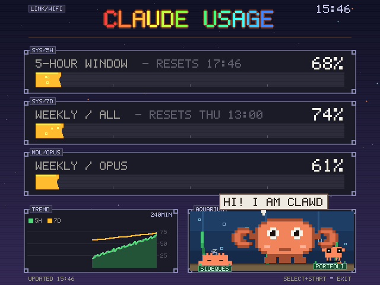
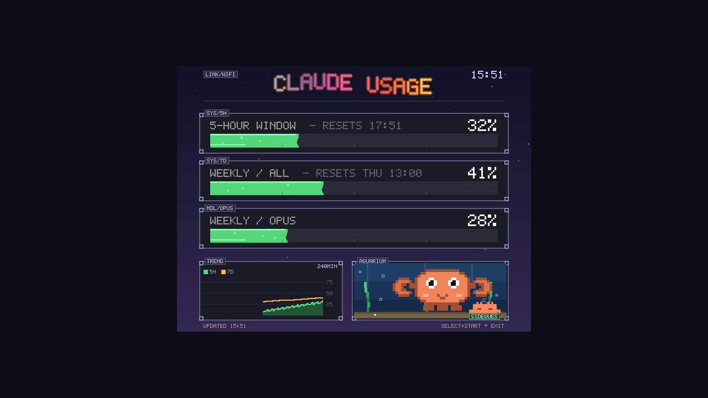

# Pocket Clawd

A Claude usage meter that lives on a cheap retro handheld, with a crab in it.



Your 5-hour window, your weekly limits and a trend chart, drawn straight to the
console's framebuffer at 640x480. Down in the corner there's a fish tank: Clawd
the crab lives there and gets progressively more worried as your usage climbs,
and every Claude Code session you have open right now shows up as a little
friend with a name sign. When Anthropic rate-limits you, the 429 pet swims in
to apologise.

It runs as its own entry on the console's main menu, next to the consoles.

---

## What you need

* **A Linux handheld with a 640x480 screen**, running firmware that gives you
  `python3` and a writable `/dev/fb0`. Developed on an "R36S" (which is really a
  K36 RK3326 clone) running [ArkOS4Clone](https://github.com/lcdyk0517/arkos4clone).
  Anything bigger than 640x480 works too — the layout is centred with a border.
  See [docs/COMPATIBILITY.md](docs/COMPATIBILITY.md) for the full list.
* **Claude Code**, logged in, on a computer somewhere. That's where the usage
  numbers come from. Or don't — see *direct mode* below.
* **A network connection** of some kind between the two. There are four ways to
  arrange that and one of them needs no PC at all.

No Python packages to install, on either side. Everything is standard library,
because a lot of handheld firmware ships a read-only filesystem with no `pip`.

## Install

Copy this folder onto the console's SD card, then over SSH (or from a terminal
on the console itself):

```sh
cd /roms/pocket-clawd
./install/install.sh
```

That puts the app in `/roms/pocketclawd/`, adds one entry to the console's
EmulationStation config so it appears on the main carousel, drops the logo into
every theme you have installed, and restarts the menu. It's safe to run twice,
it backs up the file it edits, and `install/uninstall.sh` puts everything back
exactly as it was.

Then on your computer:

```sh
python pc/clawd_pusher.py
```

Windows without Python: double-click **`pc/Start Pocket Clawd.cmd`** instead —
it uses the PowerShell version and needs nothing installed.

The console announces itself on the local network, so there is normally no IP
address to find or type. Within a couple of seconds the bars should fill in.

Full walkthrough, including the awkward cases: [docs/INSTALL.md](docs/INSTALL.md).

## Getting the numbers across

Pick whichever suits your setup — [docs/NETWORKING.md](docs/NETWORKING.md) has
the details.

| | How it works | Good for |
|---|---|---|
| **push** *(default)* | Your PC sends the numbers to the console. | Almost everyone. |
| **pull** | The console fetches them from your PC. | A console whose address keeps changing, or a firewall that blocks the PC. |
| **direct** | The console talks to Anthropic itself. | No PC at all — works on a phone hotspot, on a train. Needs a token copied onto the card, so read the docs first. |
| **hotspot** | Your PC hosts the WiFi the console joins. | Home WiFi that's 5GHz-only or WPA3-only, which a lot of USB dongles can't join. |

## Controls

| Button | What it does |
|---|---|
| **A** | Clawd says something |
| **B** | Re-roll the tank friends |
| **X** / **Y** | Dance / wave |
| **L1** / **R1** | Zoom the trend chart out and in (10 minutes to 4 hours) |
| **L2** | Play the anthem. Press again to stop. |
| **D-pad** | Show off each mood |
| **Left stick** | Walk the crab around the tank |
| **SELECT + START** | Exit |

If any of those do nothing, your handheld reports different button codes than
this one. Run `python3 clawd.py --map-buttons` on the console, press each button
when asked, and it writes the right numbers into `config.json`.

## Making it yours

* **`device/quips.txt`** — everything Clawd says, one line each. This is the
  whole feature; write your own.
* **`device/anthem.wav`** — what L2 plays. Drop in any `anthem.mp3`,
  `anthem.ogg` etc. and it takes over. The one in the repo is a chiptune
  generated by `tools/bake_chiptune.py`, so it's original and free to ship.
* **`device/config.json`** — thresholds, button codes, network mode. Every key
  is optional.
* **`tools/sim.py`** — runs the whole thing on your PC and writes a GIF or PNG.
  Iterate on the layout without a console attached; this is also how the
  screenshots in this README were made.

## More screenshots

| Plenty left | Getting close | Rate-limited |
|---|---|---|
|  |  |  |

| Nothing connected | Gone quiet | On a 1280x720 panel |
|---|---|---|
|  |  |  |

## Credits

The little pets in the fish tank are **[clawd-pet](https://github.com/abderrahimghazali/clawd-pet)**
by [@abderrahimghazali](https://github.com/abderrahimghazali) — 90-odd animated
SVG Clawds, MIT licensed, and a delight. The 21 used here are baked into
framebuffer sprites by `tools/bake_pets.py`; the originals and their licence are
in `assets/pets-svg/`. See [NOTICE.md](NOTICE.md).

The big crab is drawn in code, pixel by pixel, and is mine.

## Licence

MIT — see [LICENSE](LICENSE). Do what you like with it.

Not affiliated with Anthropic. "Claude" and "Clawd" are theirs; this just reads
your own usage numbers and draws a crab.
