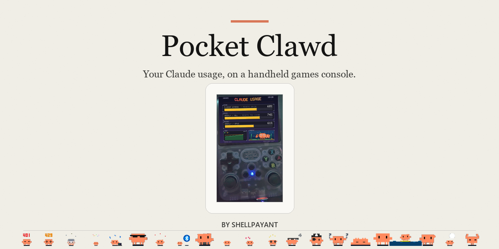

# Pocket Clawd

**Claude has usage limits that fill up as you work and reset on a timer.** This puts them on a
cheap handheld games console sitting on your desk, so you can glance at it instead of stopping to
check. There is also a crab. He lives in a fish tank at the bottom of the screen and gets visibly
worried as your usage climbs.

It's a hobby project, it's free, and it runs on a console that costs about £40.

---

## What you're looking at

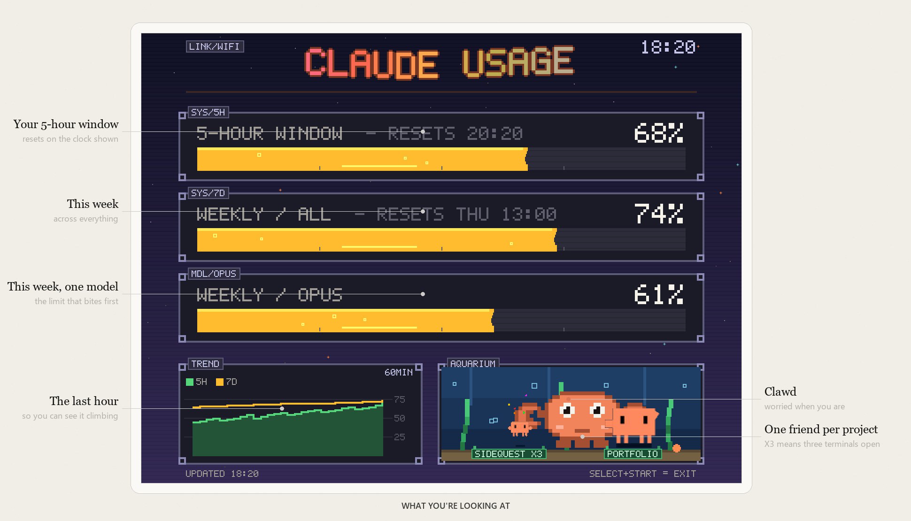

The three bars are your limits. The chart is the last hour, so you can see whether you're burning
through it or coasting. The tank at the bottom-right has one pet for every project you currently
have Claude Code open in — `SIDEQUEST X3` means three terminals in that one — and a pet that's
actually working right now looks busy rather than asleep.

Every so often another pet drifts through with its name on it. There are 21 of them and most are
tied to situations you'd rather avoid, so this is the only way you'll meet the one that turns up
when your login expires.

## What you need

| | |
|---|---|
| **A handheld** | An R36S or one of its clones — a pocket-sized Linux games console, around £40 on AliExpress. Any similar handheld with a 640×480 screen will do; [the full list is here](docs/COMPATIBILITY.md). |
| **Claude Code** | Already installed and logged in on your computer. That's where the numbers come from. |
| **A network** | Both on the same WiFi is easiest. There are other ways, including one that needs no computer at all. |

Nothing to install on either side beyond the files in this repo — no Python packages, no
dependencies. A lot of handheld firmware ships a locked-down filesystem, so everything here is
written to work without installing anything.

## How it works

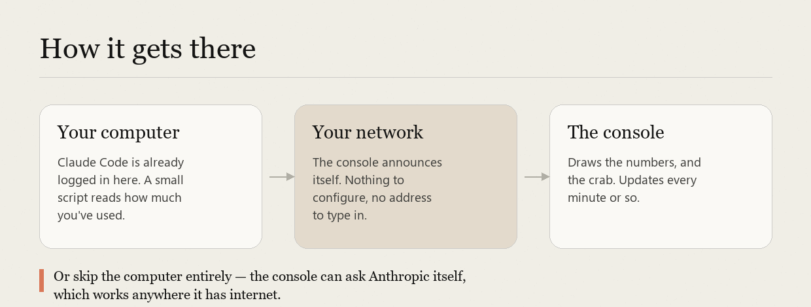

Claude Code already keeps a login on your computer. A small script uses it to ask Anthropic how
much of your own quota you've used, and sends just the percentages to the console — no prompts, no
code, no login details. You can see exactly what gets sent by running it with `--dry-run`.

## Install

**1. Put the files on the console's SD card.** Either copy the folder across with the card in your
computer, or over the network if you've turned on SSH:

```sh
scp -r pocket-clawd ark@<console-ip>:/roms/
```

**2. Run the installer, on the console:**

```sh
cd /roms/pocket-clawd
./install/install.sh
```

It adds **Pocket Clawd** to the console's main menu with its own artwork, and restarts the menu.
Safe to run twice. `install/uninstall.sh` puts everything back exactly as it was.

**3. Start it on your computer.**

* **Windows** — double-click `pc\Start Pocket Clawd.cmd`. Nothing to install.
* **Mac or Linux** — `python pc/clawd_pusher.py`

The console announces itself on the network, so there's usually no address to type. Within a few
seconds the bars fill in.

Stuck? [docs/INSTALL.md](docs/INSTALL.md) covers the awkward cases.

### If your WiFi won't work, or there's no computer around

Some of these handhelds use a cheap WiFi dongle that can't join modern 5GHz or WPA3 networks. And
sometimes you're not at home. There are four ways to get the numbers across, including the console
asking Anthropic directly with no computer involved — [docs/NETWORKING.md](docs/NETWORKING.md)
explains all four and when to pick which.

## The buttons

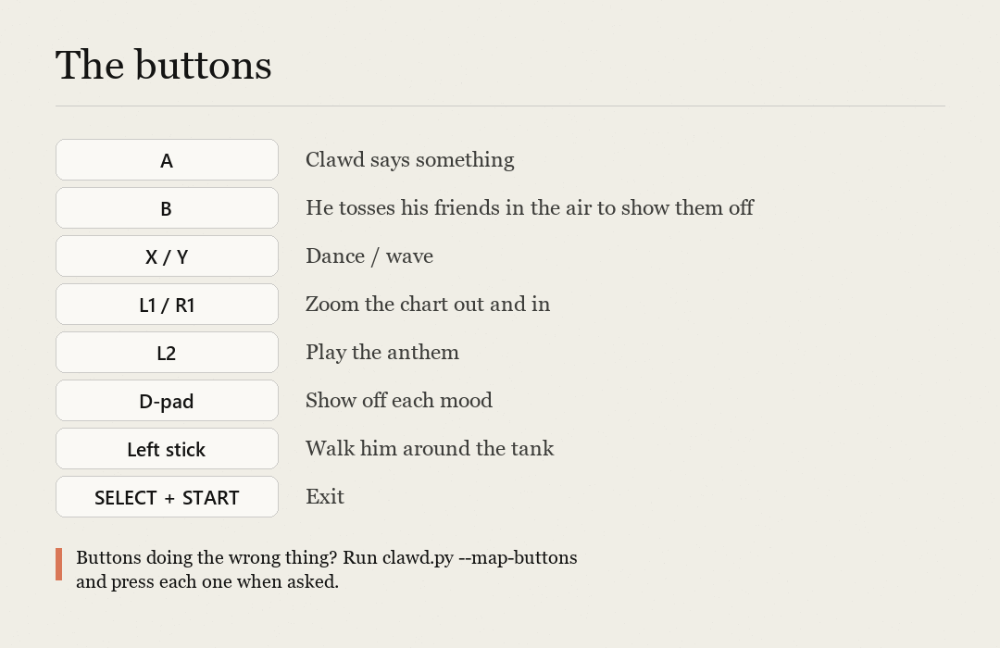

## What the different states look like

| | |
|---|---|
| 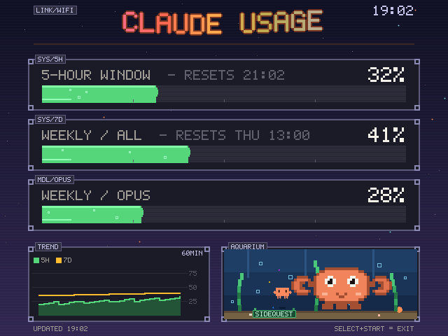 | **Plenty left.** Bars green, Clawd relaxed. |
| 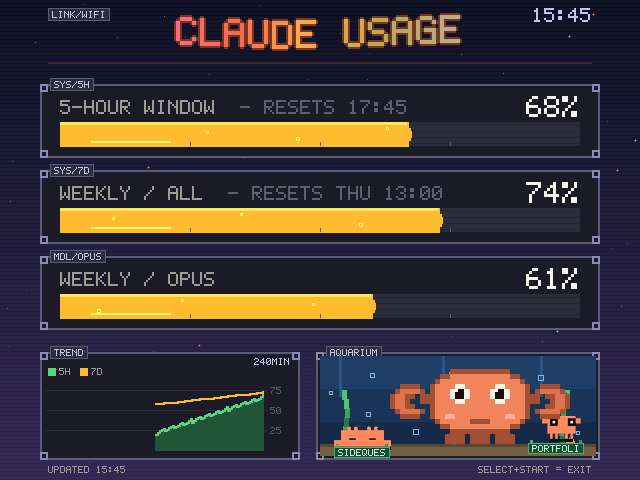 | **Getting through it.** Amber, and he's started paying attention. |
| 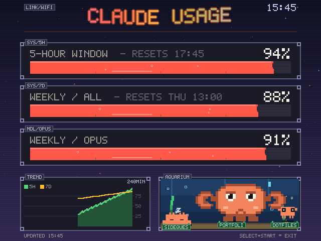 | **Nearly out.** Red, and he's alarmed. |
| 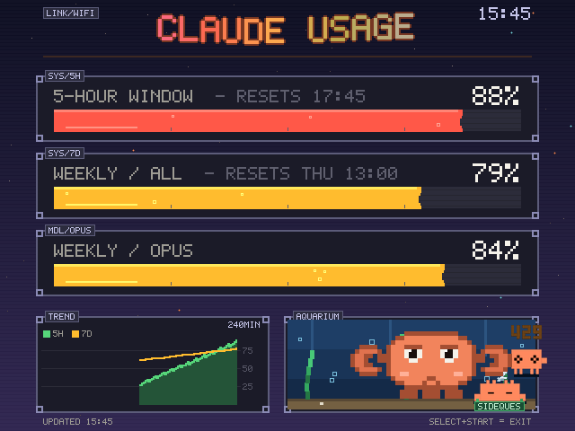 | **Anthropic is rate-limiting the check itself.** Nothing's broken — the 429 pet swims in to apologise and it retries shortly. |
| 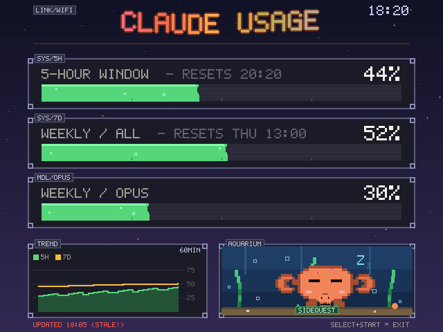 | **Nothing's arrived for ten minutes.** He goes to sleep. Usually means the computer went to sleep too. |
| 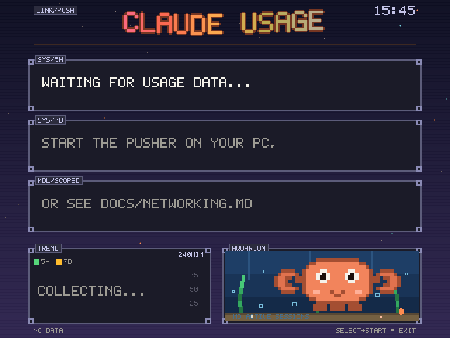 | **Never connected.** The pusher isn't running, or hasn't found the console. |

Two words get animated whenever he says them:

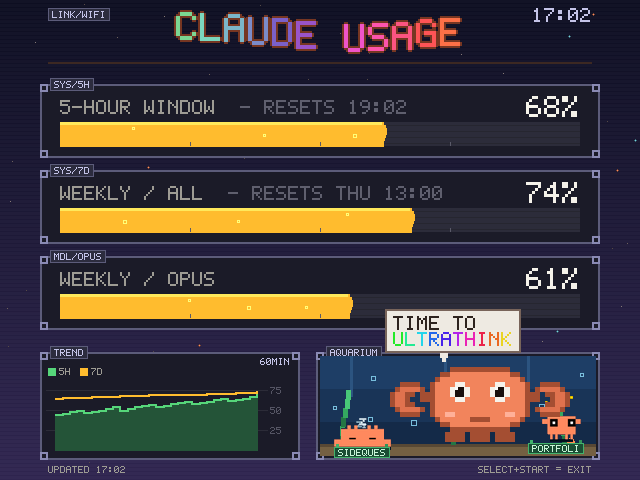

## Making it yours

Everything worth changing is a plain file you can edit on the card:

* **`quips.txt`** — everything Clawd says, one line each. This is the whole feature; write your own.
* **`anthem.wav`** — what L2 plays. Drop in any audio file named `anthem.*` and it takes over. The
  one included is a chiptune generated from arithmetic by `tools/bake_chiptune.py`, so it's
  original and free to pass on.
* **`config.json`** — thresholds, button codes, how it gets its data. Every setting is optional.

And if you don't own a handheld, `python tools/sim.py` runs the whole thing on your computer and
saves it as a picture. That's how every screenshot here was made.

## Credits

The little pets are **[clawd-pet](https://github.com/abderrahimghazali/clawd-pet)** by
[@abderrahimghazali](https://github.com/abderrahimghazali) — 90-odd animated SVG Clawds, MIT
licensed, and a delight. 21 of them are bundled here, converted into sprites the console can draw.
The originals and their licence are in `assets/pets-svg/`; see [NOTICE.md](NOTICE.md).

The big crab is drawn in code, pixel by pixel, and is mine.

## Licence

MIT — see [LICENSE](LICENSE). Do what you like with it.

Not affiliated with Anthropic. "Claude" and "Clawd" are theirs. This reads your own usage numbers,
with your own login, and draws a crab about it.
