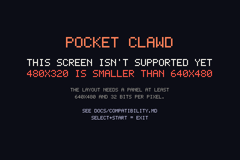

# What this runs on

Pocket Clawd needs three things from a handheld:

1. **`python3`** — no packages, just the interpreter. Several popular firmwares
   don't ship one at all.
2. **A writable `/dev/fb0`** at **32 bits per pixel**. It draws by copying raw
   bytes into the framebuffer; there is no SDL, no OpenGL, no compositor.
3. **A screen at least 640x480.** The layout is drawn at exactly that size.
   Bigger screens are centred inside a border, which costs nothing.

Check any device in ten seconds:

```sh
python3 clawd.py --panel-info
```

```
panel      : 640x480 @ 32 bpp
stride     : 2560 bytes  (2560 would be tight-packed)
memory     : 1228800 bytes
event size : 24 bytes
verdict    : supported, pixel for pixel
```

---

## Known to work

| Device | Screen | Firmware |
|---|---|---|
| **"R36S" / K36 / R35S / R33S clones** | 640x480 | ArkOS4Clone — this is the one it was built on |

That's the honest list: one device family, personally tested. Everything below
is reasoning from specifications, not from having run it.

## Should work — same shape, untested

640x480 and a firmware with python3 and fbdev:

| Device | SoC | Firmware |
|---|---|---|
| Anbernic RG351V, RG351MP | RK3326 | ArkOS, ROCKNIX, Batocera |
| Powkiddy RGB10X | RK3326 | ROCKNIX, ArkOS4Clone |
| Anbernic RG353V / VS / M / P | RK3566 | ArkOS, ROCKNIX, Batocera, Knulli |
| Anbernic RG35XX / Plus / H / SP / Pro | Allwinner H700 | Knulli, Batocera |
| Anbernic RG40XX H / V | H700 | Knulli, Batocera |
| Miyoo Flip | A133P | spruceOS (ships its own python3) |

If you try one, I'd genuinely like to know — open an issue with the output of
`--panel-info` either way.

## Should work, letterboxed

Larger panels get the 640x480 layout centred with a dark border. It looks
deliberate rather than broken, and everything works:

| Device | Screen |
|---|---|
| Powkiddy RGB30, Anbernic RGCubeXX | 720x720 |
| Powkiddy RGB10 Max / ODROID Go Super | 854x480 |
| Anbernic RG503 | 960x544 |
| TrimUI Brick, Powkiddy RGB20 Pro | 1024x768 |
| TrimUI Smart Pro | 1280x720 |


## Won't work (yet)

**Screens smaller than 640x480** — RG351P, RG351M, Powkiddy RGB10/RGB20, ODROID
Go Advance, all 480x320. The app detects this and says so instead of drawing
garbage:



Making these work means a genuinely different layout rather than a scaling
factor — the panels are 44% of the pixels. It's the obvious next thing to build
if people want it.

**Panels that aren't 32 bits per pixel** — 16-bit RGB565 is common on SigmaStar
devices (Miyoo Mini). Doable, and cheaper than the small-screen work: it's a
pixel conversion in one function.

**Firmwares with no python3** — muOS (unless you add it), OnionOS, MinUI.

**Android handhelds** — Retroid, RG406H and friends. Different world entirely.

## Notes on particular firmwares

**ArkOS / ArkOS4Clone / dArkOS.** The best case: Ubuntu-derived, real `python3`,
writable filesystem, and the installer's carousel step works exactly as
designed. SSH is off until you switch on Remote Services in the Options menu.

**ROCKNIX.** Ships Python 3.13 and a 640x480 BGRX framebuffer, so the app
itself should be fine — and it needs no packages, which matters because
ROCKNIX's `/usr` is read-only with no `pip`. The installer's carousel step won't
apply as written: ROCKNIX regenerates its EmulationStation config at boot.
Install with `./install.sh --tools-only` and launch the script directly.

**Batocera / Knulli.** python3 and fbdev are present and SSH is on by default
(`root` / `linux` on Batocera). These use a different mechanism for adding
systems — a drop-in `es_systems_*.cfg` rather than editing the main file — so
again, `--tools-only` and add the entry yourself.

**Anything mainline-kernel on RK3566/RK3588.** `/dev/fb0` there is emulated on
top of DRM. It usually exists, but check with `--panel-info` before assuming,
and stop EmulationStation first — if something else holds the display, writes
may be ignored or torn.

## Buttons

Button codes are the other thing that varies. The defaults cover the standard
Linux gamepad codes *and* the non-standard ones this class of clone emits (its
SELECT and START arrive as `BTN_TRIGGER_HAPPY1`/`2`, 704 and 705, rather than
314 and 315). Hat-style d-pads and analog triggers are handled too.

If something doesn't respond:

```sh
python3 clawd.py --map-buttons
```

Press each button when asked; it writes the codes into `config.json`. Wait
twelve seconds to skip a button your device doesn't have.
